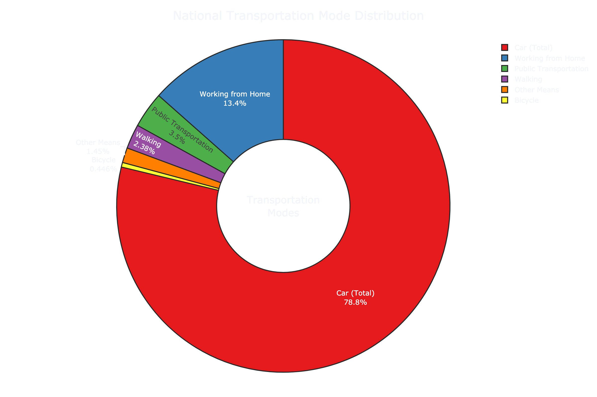
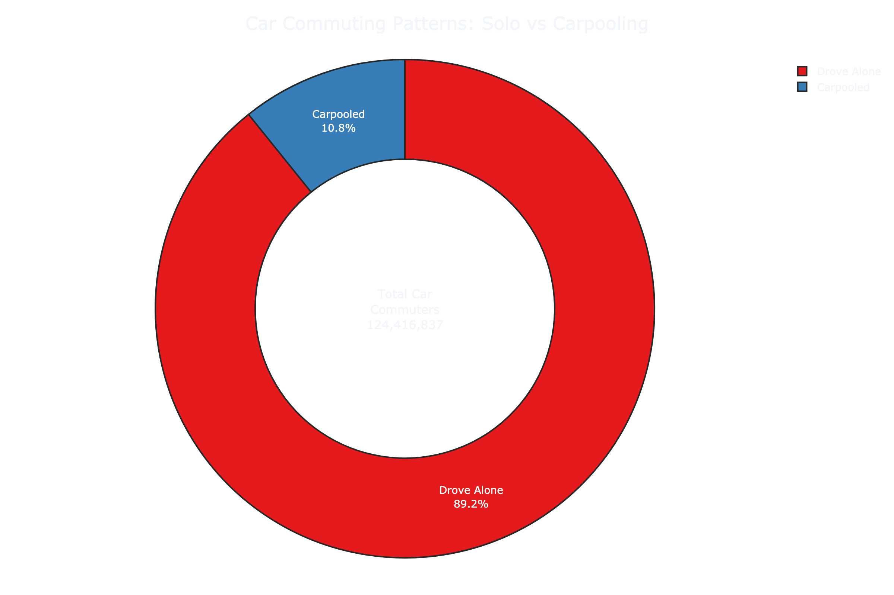
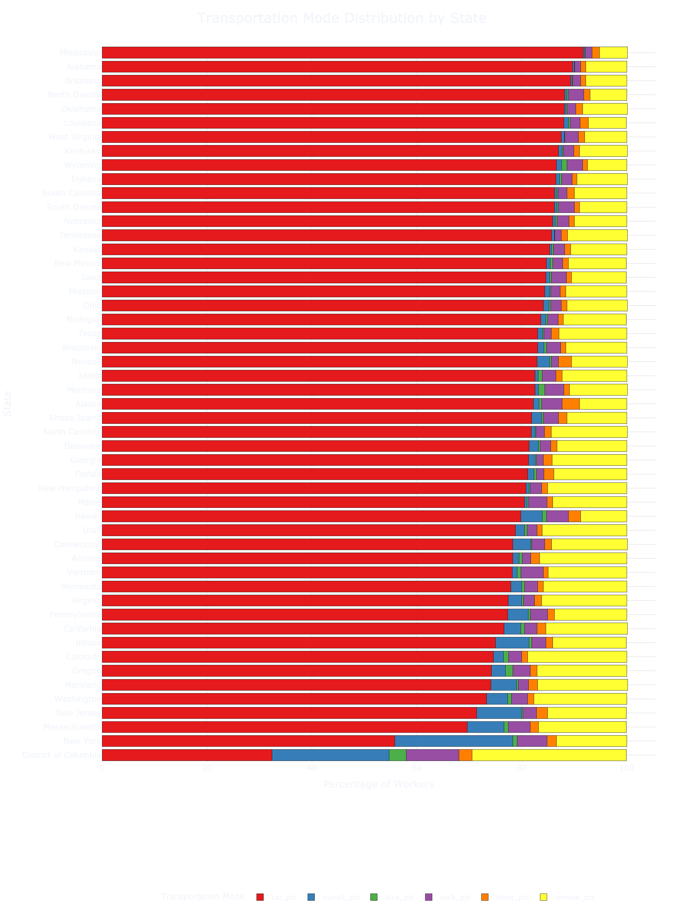
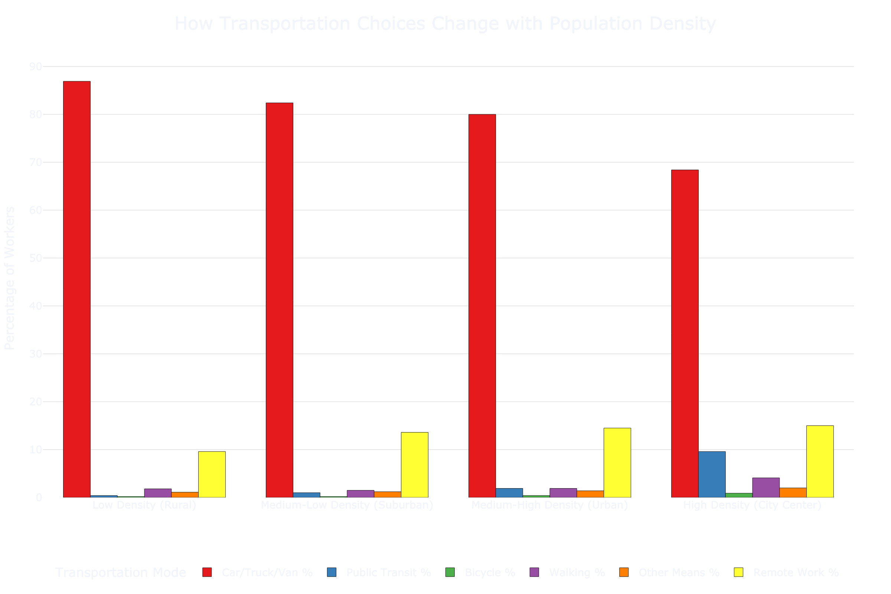

# Visualizing America's Commuting Patterns: A Deep Dive into Transportation Data

When we look at how Americans get to work, the story is best told through data visualization. Using the 2023 American Community Survey data, we've created a series of interactive visualizations that reveal fascinating patterns in commuting behavior across the United States. Let's explore what the data shows us.

## The Big Picture: How America Commutes

Our first visualization reveals the national breakdown of transportation modes. The donut chart above immediately shows the dominance of car transportation, but also reveals something surprising - remote work has become the second most common "mode" of working.

Diving deeper into car usage patterns, this visualization breaks down an important distinction: among car commuters, the vast majority (89.2%) drive alone. This stark contrast between solo drivers and carpoolers raises interesting questions about resource efficiency and environmental impact.

## State-by-State: A Geographic Perspective

This horizontal bar chart reveals dramatic differences between states. The visualization is particularly striking because it:
- Shows all transportation modes in proportion
- Arranges states by car usage (ascending)
- Uses consistent color coding for easy comparison

Key observations from this visualization:
- The District of Columbia stands out with the lowest car usage (32.4%)
- Mississippi shows the highest car dependency (91.7%)
- Coastal states generally show more diverse transportation patterns

## The Urban-Rural Connection

Perhaps our most revealing visualization shows how population density influences transportation choices. The grouped bar chart makes it easy to compare transportation modes across different density levels, revealing:

- A clear decline in car usage as density increases (87.1% → 75.9%)
- Public transit usage increasing with density (0.4% → 4.5%)
- Remote work maintaining surprisingly consistent levels across density categories

## Interactive Exploration

All these visualizations are available in interactive form in our [GitHub repository](https://github.com/Burton-David/us-transportation-analysis). The repository includes:
- Complete Python code for reproduction
- Interactive Plotly visualizations
- Raw data and cleaning procedures

## Technical Notes

These visualizations were created using:
- Plotly Express for interactive plotting
- A dark theme for better contrast and readability
- Consistent color schemes across all visualizations
- Careful attention to accessibility in color choices

Each visualization is available in both static (PNG) and interactive (HTML) formats, with the interactive versions allowing for detailed exploration of the data through hovering, zooming, and filtering capabilities.

## Methodology

The visualizations are based on the 2023 American Community Survey 5-year estimates, analyzing:
- Data from 84,393 census tracts
- Six primary transportation modes
- Population density calculations
- State-level aggregations

Code and data are available at [github.com/Burton-David/us-transportation-analysis](https://github.com/Burton-David/us-transportation-analysis).
